# PapiKos
### By A06 Advanced Programming Group
| NAMA                        | NPM           | RESPONSIBILITY          |
|-----------------------------|---------------|-------------------------|
| Stefanus Tan Jaya           | 2306152456    | Penyewaan Kos           |
| Malvin Muhammad Raqin       | 2306275821    | Payment                 |
| Hishah Khalishah            | 2206083703    | Wishlist & Notification |
| Rachel Mathilda             | 2206081673    | Pengelolaan Kos         |
| Priscilla Natanael Surjanto | 2306152153    | Chat                    |

## Software Architecture (Module 9)
### Context Diagram
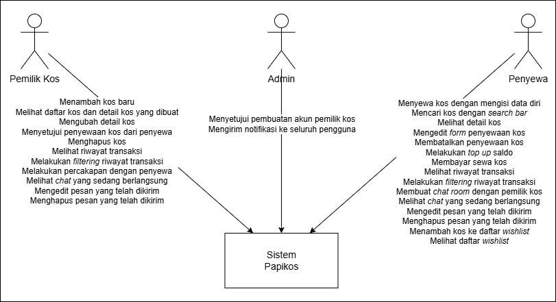
### Container Diagram
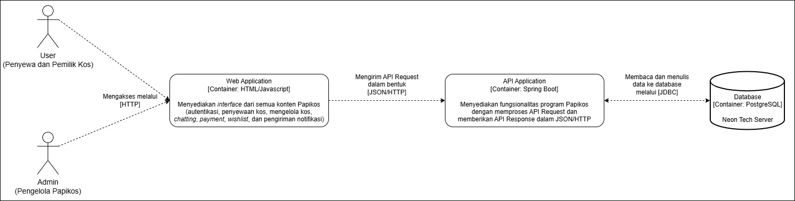
### Deployment Diagram
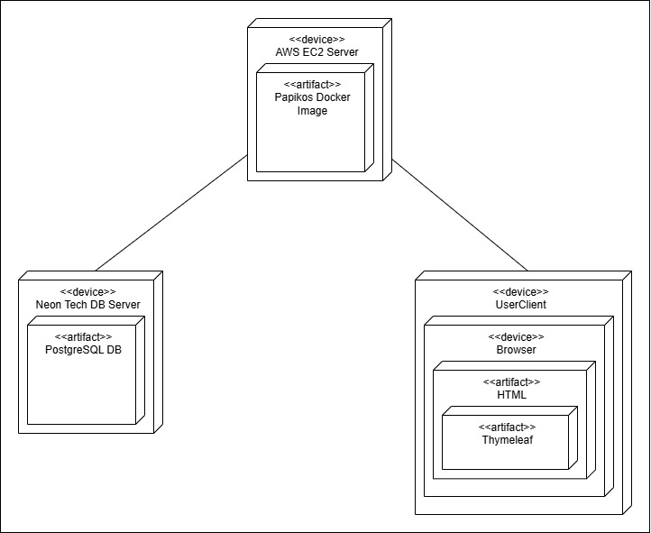
### Future Architecture
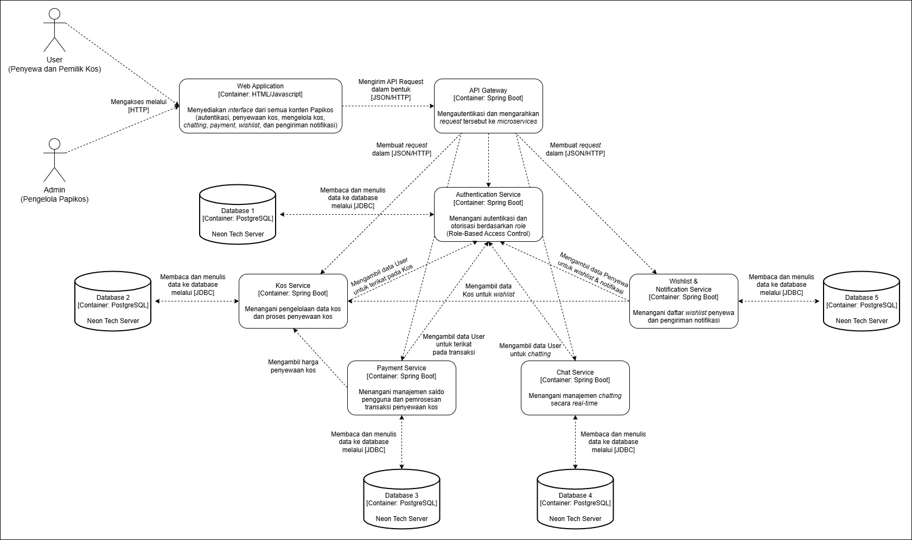
### Risk Storming Analysis
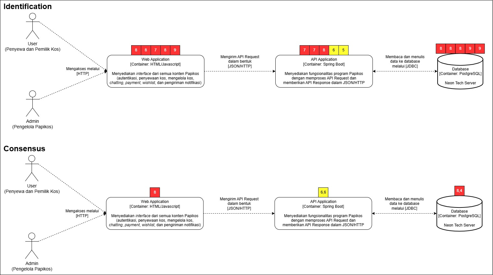
  
Berdasarkan analisis _risk storming_ yang kami lakukan, struktur monolitik yang sekarang kami implementasikan tetap beresiko terhadap potensi celah keamanan dan serangan berbahaya. Pada Web Application, potensi _threat_ yang bisa terjadi antara lain XSS, CSRF, dan Broken Auth. Pada API Application, dapat terjadi serangan Denial of Service (DoS), Injection, atau kelalaian seperti _dependency vulnerabilities_. Pada database yang kami nilai paling berpotensi sebagai target serangan atau celah keamanan, seperti SQL Injection, _data at rest_ yang tidak terenkripsi, dan port DB yang terekspos.   
Salah satu bentuk mitigasi yang kami rencanakan untuk masa depan adalah mengembangkan struktur program Papikos dari monolitik menjadi microservices seperti yang digambarkan pada Future Architecture. Beberapa keunggulan yang ditawarkan struktur microservices yang menjadi pertimbangan diskusi kami antara lain Defense in Depth via API Gateway dan Independent Security Hardening di mana tiap servis bisa diatur konfigurasi keamanannya masing-masing dan tiap _traffic_ antar servis dapat terus diperhatikan. Selain itu, setiap servis hanya mengekspos API spesifik dan hanya punya akses ke database-nya sendiri, sehingga jika satu servis diserang, servis lain tetap aman.  
Namun, kami sadar bila mengganti sistem menjadi microservices juga membuka peluang _threat_ keamanan yang baru. Beberapa potensi yang sudah kami identifikasi dari analisis ini adalah jangkauan serangan atau celah keamaman yang meluas karena implementasi servis terpisah. Hal ini juga mempengaruhi konfigurasi keamanan yang nantinya kami aplikasikan menjadi lebih banyak dan bisa lebih kompleks daripada keamanan dengan struktur monolitik. Kami akan terus berdiskusi untuk menentukan langkah terbaik jika pengembangan program Papikos ini lancar hingga tahap perilisan.

### Individual Diagram
### Stefanus Tan Jaya
#### Component Diagram
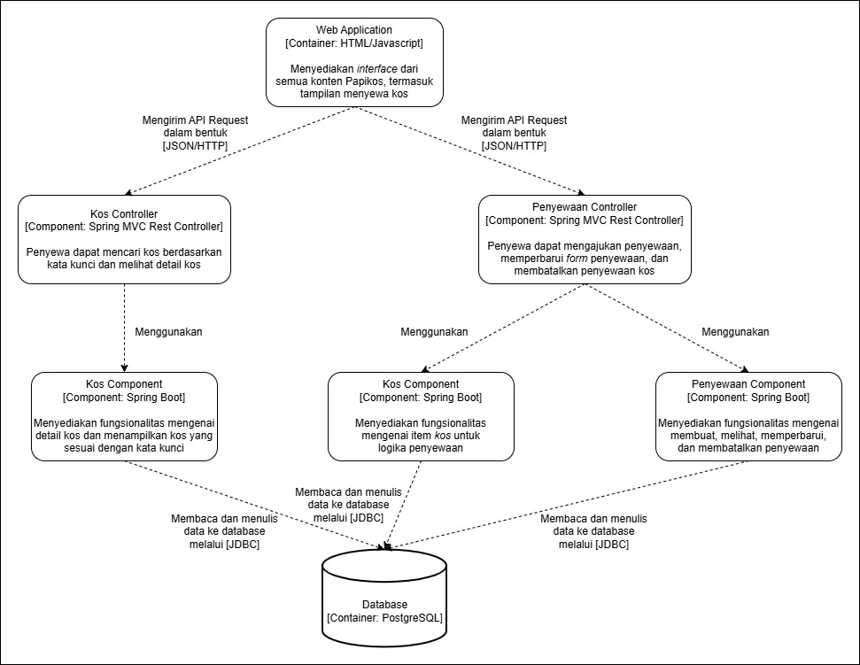
#### Code Diagram
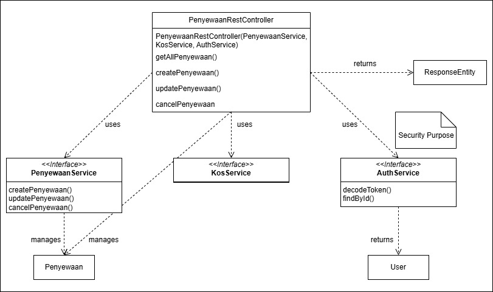
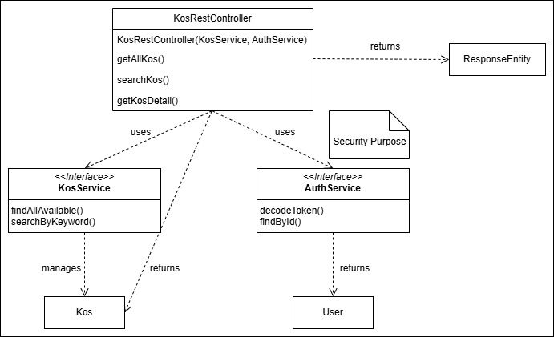
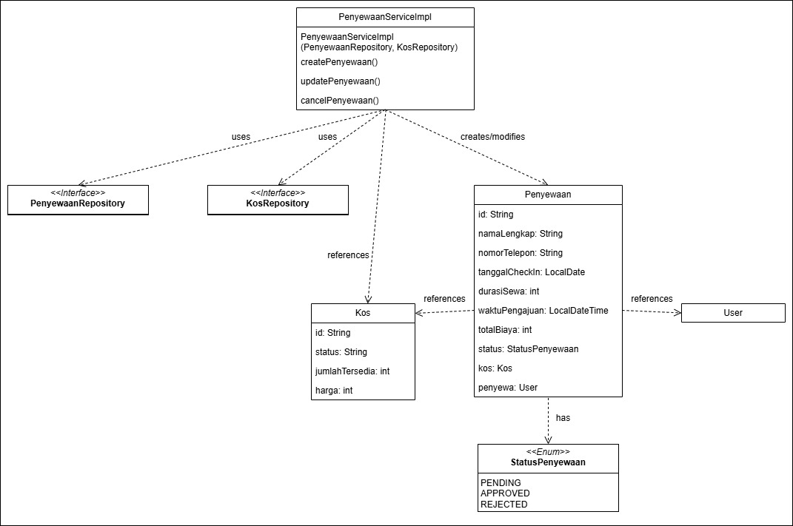
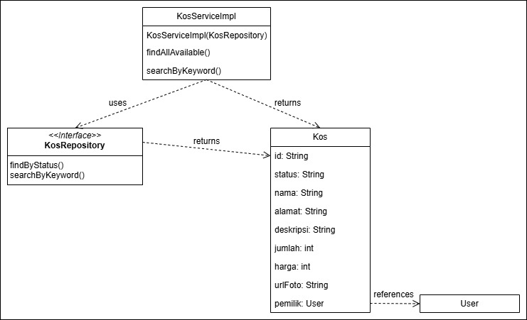

### Malvin Muhammad Raqin
#### Component Diagram
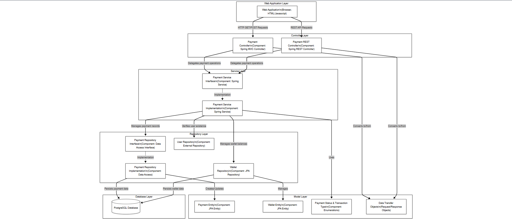
#### Code Diagram
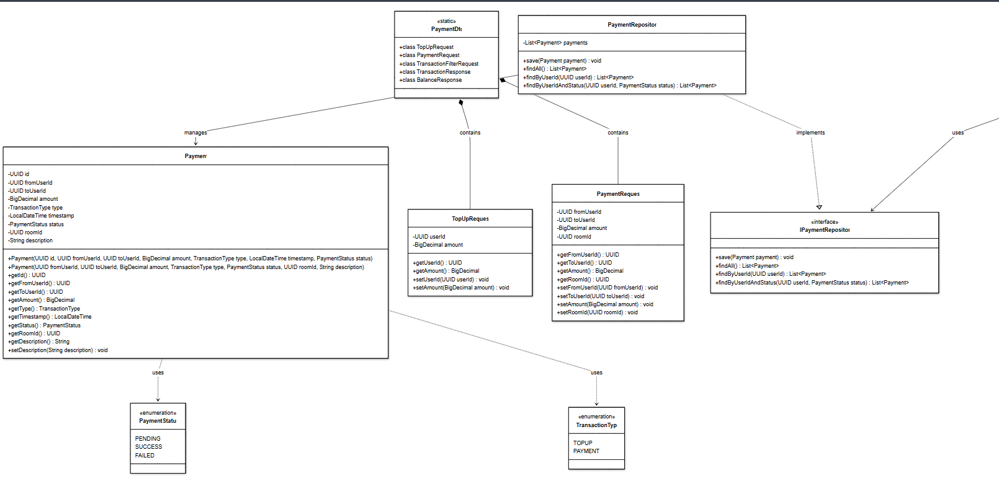
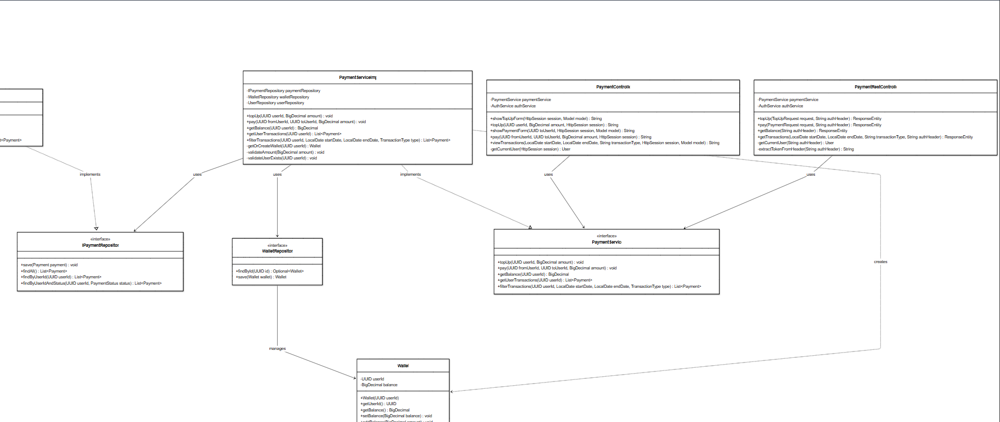